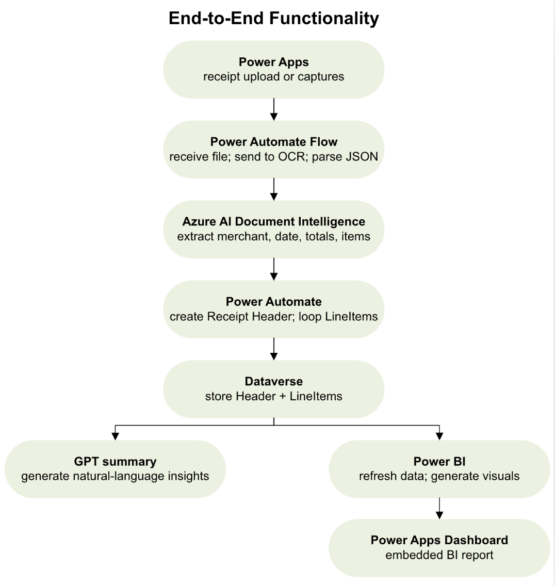
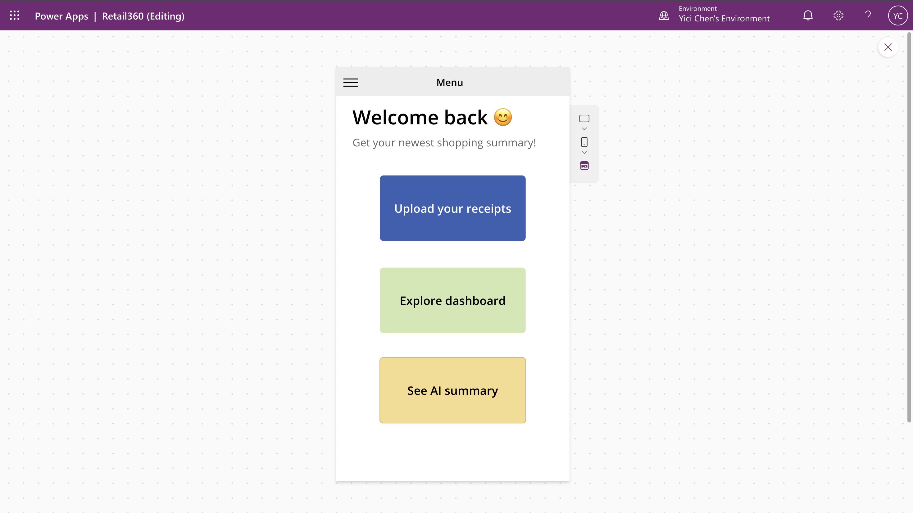
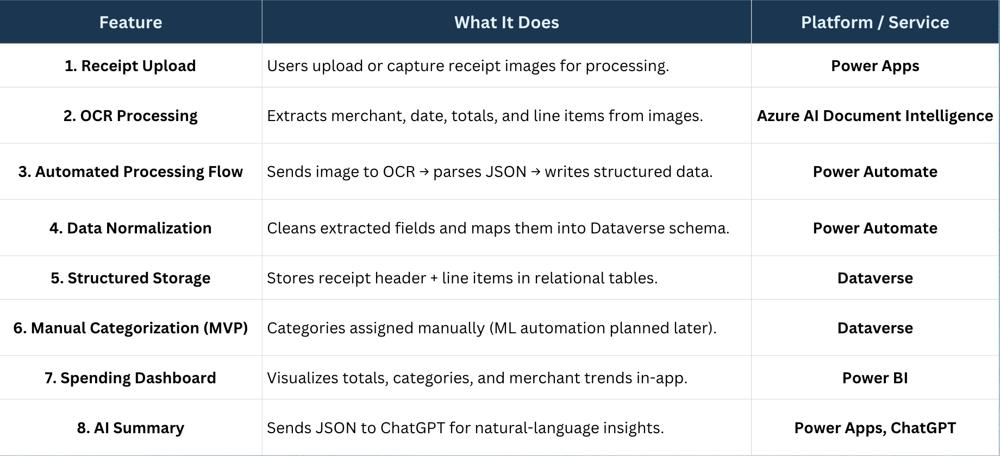
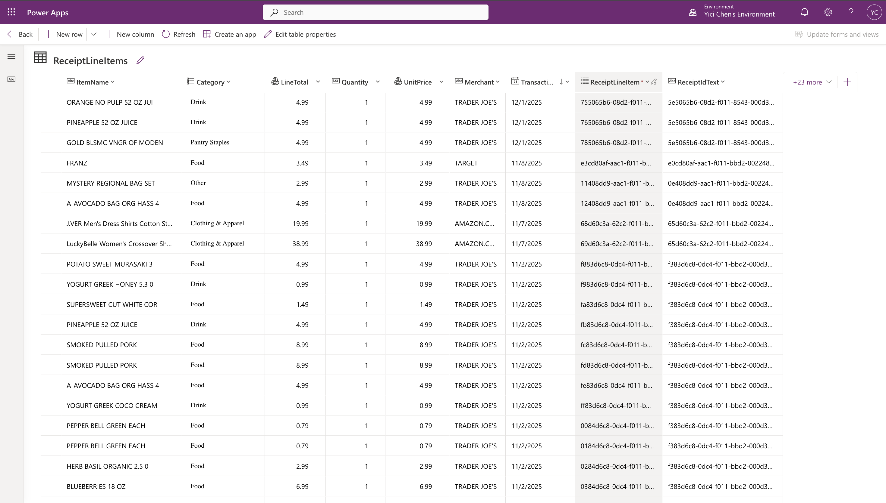
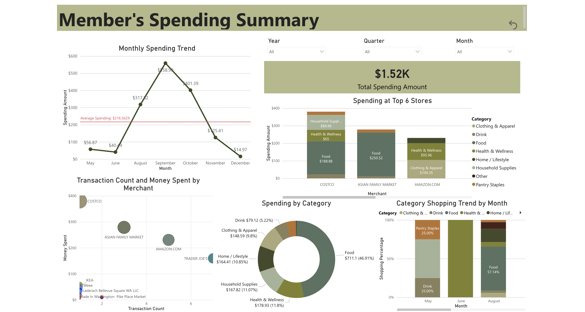

# Retail360: AI-Powered Receipt Intelligence for Cross-Retailer Consumer Insights

Retail360 is an end-to-end MVP that helps retailers understand customer behavior beyond their own ecosystem by turning uploaded receipts from other retailers into structured, actionable intelligence.

Built with Microsoft Power Platform and AI services, the system combines receipt ingestion, OCR extraction, workflow automation, relational storage, business intelligence, and AI-generated summaries into a single product workflow. The project was designed to address a real retail blind spot: companies can see what customers buy from them, but often have little to no visibility into what those same customers purchase from competitors.

## Why This Project Matters

Modern retail behavior is fragmented across channels and brands. Shoppers compare prices, split purchases across multiple stores, and shift loyalty quickly. In this environment, relying only on internal transaction data leads to incomplete customer understanding, weaker targeting, and mistimed engagement. Retail360 was designed to close that gap by giving customers a reason to upload receipts from any retailer, while giving the business a fuller picture of cross-retailer behavior.

This project is especially relevant because it demonstrates how AI can be operationalized inside a product workflow, not just used as a standalone model. It also shows how data, automation, analytics, and UX can be integrated into a practical MVP under real platform and subscription constraints.

## Problem

Retailers typically have strong visibility into their own online and in-store channels, but limited visibility into what customers buy elsewhere. That blind spot weakens promotion accuracy, reduces the quality of customer intent signals, and makes marketing more reactive than strategic. Retail360 addresses this by capturing cross-retailer receipt data and transforming it into structured insights for both customers and internal teams.

## Solution

Retail360 introduces an AI-enabled receipt intelligence feature that allows users to upload paper or digital receipts from any retailer. In return, users can receive rewards, track spending across merchants, explore dashboards, and generate AI-based summaries of their purchase behavior. On the business side, the same data provides visibility into cross-retailer shopping patterns, supporting better targeting, better timing, and stronger decision-making.

## My Focus

This portfolio version highlights the project as a systems and product case study, with emphasis on:

- translating a retail business problem into an end-to-end AI-enabled MVP
- designing a workflow across Power Apps, Power Automate, Azure AI services, Dataverse, and Power BI
- structuring receipt data into a usable relational model for downstream analytics
- balancing product ambition with realistic MVP constraints
- demonstrating how AI can support both customer-facing and internal decision workflows

## Tech Stack

Retail360 uses a layered Microsoft-centered architecture:

- **Power Apps** for the user-facing interface
- **Power Automate** for workflow orchestration and JSON parsing
- **Azure AI Document Intelligence** for receipt OCR and structured extraction
- **Microsoft Dataverse** for relational storage
- **Power BI** for dashboarding and analytics
- **ChatGPT workaround** for natural-language summaries in the MVP
- **Planned future services**: Azure OpenAI, Azure Text Analytics, Azure ML Designer

## End-to-End Workflow

The system pipeline is designed to move from unstructured receipt images to structured, decision-ready insights:

1. User uploads or captures a receipt in Power Apps  
2. Power Automate triggers the processing flow  
3. Azure AI Document Intelligence extracts merchant, date, totals, and line items  
4. Power Automate normalizes the JSON output and writes records into Dataverse  
5. Dataverse stores structured receipt headers and line items  
6. Power BI generates dashboards and visual insights  
7. ChatGPT generates a natural-language spending summary from serialized receipt data

## Example Outputs & System Design

This section highlights the key components of the Retail360 system, from user interaction to AI-driven insight generation.

### End-to-End System Flow

This flow illustrates the full pipeline from receipt upload to OCR extraction, structured storage, analytics, and AI-generated insights. It reflects the project’s central design goal: turning unstructured consumer receipts into structured intelligence through a modular, low-code architecture.

---

### MVP Application (Power Apps)

The Power Apps interface provides a simple entry point for users to upload receipts, explore dashboards, and request AI summaries. This design keeps the experience unified and mobile-friendly while reducing the need for custom front-end engineering.

---

### Core Features and Service Mapping

This view shows how each functional feature maps to a specific platform or service. It highlights the project’s orchestration logic across upload, OCR, processing, storage, dashboarding, and summarization, demonstrating product-level system integration rather than isolated feature development.

---

### Data Modeling in Dataverse

Retail360 uses Dataverse as a relational storage layer for receipt headers and line items. This structure enables downstream analytics, supports parent-child relationships between transactions and purchased items, and creates a clean foundation for future AI extensions such as automated categorization and purchase-cycle prediction.

---

### Business Intelligence Dashboard

The Power BI dashboard transforms extracted receipt data into spending distributions, merchant-level patterns, and category-level insights. This layer is critical because it converts processed data into decision-support outputs that can serve both end users and internal business teams.

## Results

The solution was evaluated on a dataset of more than 200 real-world receipts collected from multiple retail contexts, including grocery, general merchandise, e-commerce, and food and beverage. Manual review suggested strong performance on key extraction fields such as merchant name, transaction date, quantities, and totals, while line-item extraction showed more variability due to formatting differences and receipt quality. The system successfully normalized extracted data into Dataverse, generated interpretable dashboards, and produced coherent AI summaries from structured JSON inputs.

## Business Impact

Retail360 was positioned as a digital transformation initiative with both customer-facing and business-facing value. Based on the project’s assumptions and modeled adoption scenario, the proposed system could reduce wasted marketing spend, improve retention, increase customer lifetime value, and deliver very high ROI relative to operating cost. The paper estimates an annual ROI above 800%, while also noting that a real pilot would be needed to validate adoption and revenue assumptions.

## Design Tradeoffs and MVP Constraints

This MVP was intentionally scoped to balance ambition with feasibility. Some planned components were designed but not fully implemented because of student-environment limitations, especially around Azure OpenAI and Azure ML access. As a result:

- GPT summaries used a workaround instead of embedded Azure OpenAI
- purchase-cycle prediction was not implemented
- OCR accuracy still depended on receipt quality
- privacy and compliance controls remained partial in the MVP

These constraints are important because they show realistic product judgment. I prioritized proving the core workflow before overbuilding advanced intelligence layers.

## What This Project Demonstrates

Retail360 demonstrates the ability to:

- frame a business problem in data and product terms
- design an end-to-end AI-enabled system under practical constraints
- integrate multiple Microsoft services into a coherent workflow
- structure unstructured OCR outputs into analytics-ready data
- think beyond model outputs and focus on delivery, usability, and business value

## Repository Structure

- `assets/` visual assets used in the README
- `demo/` demo materials
- `docs/business_problem.md` business context and value proposition
- `docs/system_architecture.md` architecture, components, and workflow
- `docs/methodology.md` technical design, methods, and implementation logic
- `docs/results.md` results, evaluation, limitations, and business impact

## Demo

See `demo/demo.mp4` for a walkthrough of the MVP.

## Note

This repository presents a portfolio version of an academic MVP and is intended to highlight the project’s product logic, architecture, AI integration, and business relevance in a clear professional format.
